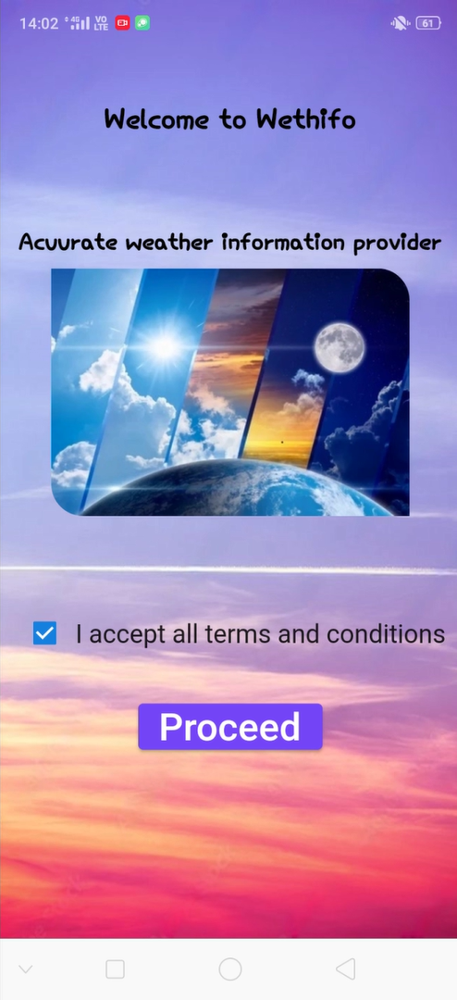
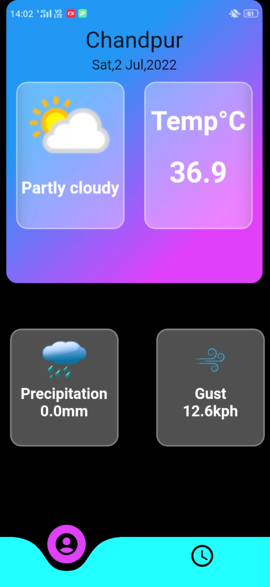
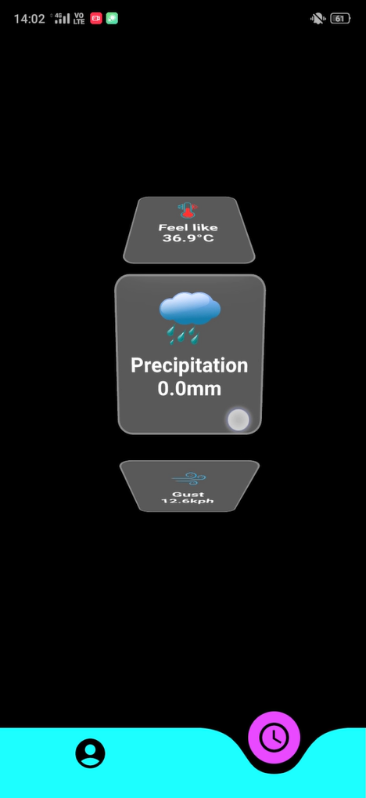
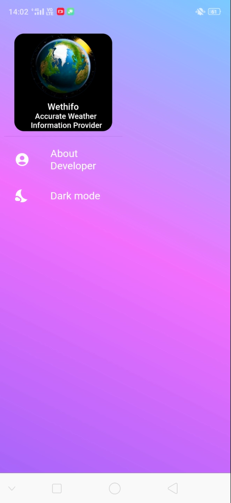

# Wethifo-Weather App ( Using - Flutter )

[⬇️Download App](https://drive.google.com/file/d/1ZIUbyNhVIDLIwWozSYv3mDN1kwQHFNv1/view?usp=sharing)

|||
|:----------------------------------------:|:-----------------------------------------:|
|  </a> <a href="https://www.java.com" target="_blank"> |  </a> <a href="https://www.java.com" target="_blank">  |
 
 

 
 

 
 ## 🤔 What is this App
 
 ✍️ Here is "Wethifo".You can get the accurate weather information of your location on one click.
 
 ## 💡 Features Used

1. Flutter

<h1 align=center> Project Admin  🤵 </h1>

  

  
  

  &nbsp;&nbsp;&nbsp;&nbsp;
  &nbsp;&nbsp;&nbsp;&nbsp;

  
   
  
  ## 📸 Screenshots
 

 

||||
|:----------------------------------------:|:-----------------------------------------:|:-----------------------------------------:|
|  | |  |
|  | |  | 
  
 

  
  
  <h2 align="center">📝 Created by </h2>

<h3>Arpit Verma</h3>

  
  
   
